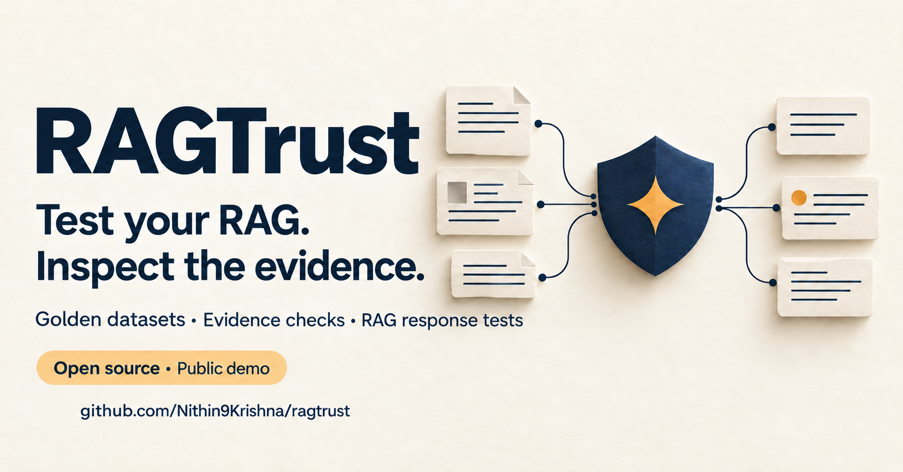

# RAGTrust

RAGTrust is a working multi-agent application for creating, independently validating, reviewing, and exporting synthetic evaluation datasets for retrieval-augmented generation systems.

[](https://github.com/Nithin9Krishna/ragtrust/actions/workflows/ci.yml)

[](docs/LINKEDIN_POST.md)

[Open the public demo](https://ragtrust-sainithin-public-2026.azurewebsites.net/) · [Source on GitHub](https://github.com/Nithin9Krishna/ragtrust) · [Report an issue](https://github.com/Nithin9Krishna/ragtrust/issues)

Launched October 8, 2026. The public MIT-licensed repository uses the `main` branch and accepts issues. The hosted demo opens an anonymous Streamlit workspace in fixture mode. Each browser session gets a separate temporary directory and SQLite database. Foundry inference is disabled at the client boundary. The public host does not expose the FastAPI lifecycle API.

Start with [the public demo guide](docs/PUBLIC_DEMO.md): load the included sample, inspect and release a dataset, then compare recorded RAG answers or connect a compatible public HTTPS endpoint. Use only non-confidential demonstration uploads. Public sessions reset on the next interaction after two hours; disconnected sessions have a 120-second reconnect window. Download exports before leaving. The public demo is not durable storage or an account-based service.

Public limits are 20 candidates per run, one repair per case, and 5 MB per upload. The Azure F1 free host can cold-start or become temporarily unavailable.

The core product works without a connected RAG endpoint. Optional RAG endpoint testing is a separate workflow and report.

## What is implemented

- Streamlit interface for project creation, upload, planning, generation, monitoring, review, calibration, release, and optional RAG testing.
- FastAPI API for the same core lifecycle.
- Four application-orchestrated roles persisted as versioned Microsoft Foundry prompt agents:
  - Dataset Understanding and Planning Agent
  - Generation Agent
  - Independent Validation Agent
  - Coverage and Refinement Agent
- Optional Microsoft Foundry model integration through `azure-ai-projects` 2.x and `DefaultAzureCredential`, for your own local or private deployment.
- Explicit fixture mode that is deterministic, offline, and labelled in reports. Live Foundry failures fail closed; they never silently become fixture results.
- SQLite storage through SQLAlchemy with PostgreSQL-compatible models for projects, sources, evidence, golden examples, runs, cases, metrics, reviews, releases, reports, and optional RAG runs. Public sessions use separate temporary databases; local/private deployments can retain their data.
- Database-backed run state plus a local background worker endpoint, cancellation flag, bounded repair attempts, budget-limited candidate generation, and target-shortfall reporting.
- CSV and JSONL golden dataset import.
- Text and PDF extraction. PDFs without extractable text are marked `needs_ocr` and are not treated as evidence.
- Narrow video/transcript evidence support using JSON, VTT, or SRT-style timestamped segments. Invalid timestamp ranges are rejected.
- Original uploaded files saved in project-isolated local storage through a storage abstraction.
- Deterministic citation, structure, numeric support, exact-duplicate, lexical-near-duplicate, coverage, and Jensen-Shannon distribution checks.
- Independent claim-level fixture evaluator and optional live Foundry evaluator.
- Human-labelled evaluator calibration with accuracy, precision, recall, F1, confusion matrix, and Cohen's kappa.
- Immutable versioned releases containing:
  - canonical JSONL dataset
  - flattened CSV dataset
  - case-level JSONL assessments
  - HTML quality report
  - machine-readable JSON summary
- Optional RAG endpoint or recorded-response testing kept separate from dataset quality. Fixture responses require an explicit demonstration selection.
- Application Insights/OpenTelemetry initialization when configured.

## Honest limitations

- Fixture mode uses documented deterministic rules. It is useful for testing the workflow but is not live model generation or independent proof of correctness.
- The current text evaluator is a transparent prototype rubric, not Ragas. `ragas==0.4.3` is provided as an optional dependency for a later calibrated metric adapter; Ragas is not used to produce the included demo scores.
- Human-audited correctness and judge reliability appear as `not assessed` until representative human labels are supplied.
- PDF OCR is detected but not performed automatically.
- The working multimodal path accepts timestamped transcript evidence. It does not perform audio transcription, video motion understanding, or visual-only verification. Transcript evidence must not be presented as proof of a visual claim.
- Uploaded images and raw audio/video extraction are not supported by this version. Do not claim universal format support.
- Execution uses an in-process background thread. A process restart can interrupt work; automatic resume and a distributed production queue are not implemented. Public session data is temporary, even when a release is frozen.
- Near-duplicate detection uses character-trigram cosine similarity at a threshold of 0.82. It is a lexical heuristic, not a calibrated semantic embedding metric. Coverage gaps are reported; repeated generation to fill all gaps is not automated.
- Candidate budget units limit generated volume; they are not provider token counts or currency estimates.
- The optional RAG adapter accepts a public HTTPS endpoint on port 443 receiving `{"query": "..."}` and returning a string `answer` or `response`, or recorded responses. It reports latency, errors, reference-token recall, and heuristic abstention matching. Lexical overlap is not faithfulness or factual accuracy; semantic answer quality and retrieval metrics remain not assessed. Endpoint authentication headers are not supported; use recorded responses for private or authenticated systems.

## Installation

From the `ragtrust` directory:

```bash
python3 -m venv .venv
source .venv/bin/activate
python -m pip install --upgrade pip
pip install -e '.[dev]'
cp .env.example .env
```

The committed `.env.example` contains placeholders only. Never commit real connection strings or keys.

## Environment variables

Local fixture mode requires no cloud credentials:

```dotenv
RAGTRUST_MODE=fixture
RAGTRUST_PUBLIC_DEMO=false
RAGTRUST_DATA_DIR=./data
RAGTRUST_DATABASE_URL=sqlite:///./data/ragtrust.db
RAGTRUST_MAX_CANDIDATES=100
RAGTRUST_MAX_REPAIRS=2
```

To run the anonymous public UI configuration, set:

```dotenv
RAGTRUST_MODE=fixture
RAGTRUST_PUBLIC_DEMO=true
RAGTRUST_MAX_CANDIDATES=20
RAGTRUST_MAX_REPAIRS=1
```

Public mode creates a temporary database and file workspace for each browser session, caps session lifetime at two hours, and disables Foundry calls even if cloud settings exist. The API rejects all routes except `/health` in this mode. The public UI restricts uploads to 5 MB. Endpoint requests require public HTTPS on port 443, pin the resolved public address while preserving the original Host and TLS server name, and disable proxies and redirects. Responses are limited to 1 MiB. There is no public hosted API.

Live Foundry mode requires `RAGTRUST_PUBLIC_DEMO=false`. It uses your configured project and model deployment and does not provision resources:

```dotenv
RAGTRUST_MODE=foundry
RAGTRUST_PUBLIC_DEMO=false
FOUNDRY_PROJECT_ENDPOINT=https://RESOURCE.services.ai.azure.com/api/projects/PROJECT
FOUNDRY_MODEL_NAME=gpt-4o
FOUNDRY_USE_DEPLOYED_AGENTS=true
FOUNDRY_AGENT_VERSION=2
# Set privately for shared/cloud use; do not commit its value.
RAGTRUST_ACCESS_PASSWORD=
APPLICATIONINSIGHTS_CONNECTION_STRING=
AZURE_EXPERIMENTAL_ENABLE_GENAI_TRACING=true
OTEL_INSTRUMENTATION_GENAI_CAPTURE_MESSAGE_CONTENT=false
```

Authenticate with Azure CLI before using Foundry mode:

```bash
az login
```

## Run the measured local demo

```bash
PYTHONPATH=src .venv/bin/python -m ragtrust.orchestrator
```

The command loads the clearly labelled IT-security fixture dataset, executes all four roles, validates and repairs cases, records the target shortfall if applicable, and writes a versioned release under `data/releases/`.

The included demo inputs are under `demo_data/`:

- `golden_support_qa.csv`
- `security_compliance_policy.txt`
- `security_walkthrough_video.json`
- `calibration_benchmark.json`

## Start the interface

```bash
PYTHONPATH=src .venv/bin/streamlit run src/ragtrust/app.py
```

Open the URL printed by Streamlit, normally `http://localhost:8501`.

## Start the local/private API

```bash
PYTHONPATH=src .venv/bin/uvicorn ragtrust.api:app --host 127.0.0.1 --port 8000
```

Interactive API documentation is available at `http://127.0.0.1:8000/docs`.

Run this with `RAGTRUST_PUBLIC_DEMO=false`. Public mode blocks every API route except `/health`; browser session isolation is implemented in the Streamlit UI, not through an anonymous API.

When `RAGTRUST_ACCESS_PASSWORD` is configured, API requests other than `/health` require the same value in the `X-RAGTrust-Key` header. Keep the value out of recordings, source control, and submission archives.

Useful endpoints include:

- `POST /projects`
- `POST /projects/{id}/golden-examples`
- `POST /projects/{id}/sources`
- `POST /projects/{id}/profile`
- `POST /projects/{id}/generation-runs` for a synchronous run
- `POST /projects/{id}/generation-jobs` for a local background job
- `POST /generation-runs/{id}/cancel`
- `GET /generation-runs/{id}`
- `GET /generation-runs/{id}/cases`
- `POST /cases/{id}/review`
- `POST /generation-runs/{id}/releases`
- `GET /datasets/{id}/report`
- `GET /datasets/{id}/export?format=jsonl|csv|assessments`
- `POST /datasets/{id}/rag-runs`
- `POST /evaluator/calibrate`

## Run tests

```bash
.venv/bin/pytest -q
```

The launch verification passed 88 local tests. [GitHub Actions](https://github.com/Nithin9Krishna/ragtrust/actions/runs/37858292405) passed on Python 3.11 and 3.13 for runtime commit [`abb38ee`](https://github.com/Nithin9Krishna/ragtrust/commit/abb38ee01e86741511ba19dac2ee1667074e0b4e), including session-isolation and endpoint transport checks.

## Deploy and verify the Foundry agents

The deployment command creates a new immutable version of each named agent in the configured existing project. It does not create a Foundry resource, project, or model deployment.

```bash
PYTHONPATH=src .venv/bin/python scripts/deploy_foundry_agents.py
PYTHONPATH=src .venv/bin/python scripts/verify_foundry_agents.py
PYTHONPATH=src .venv/bin/python scripts/run_live_foundry_demo.py
```

The application uses the persisted definitions through the Responses API `agent_reference` contract. The reviewed release pins `FOUNDRY_AGENT_VERSION=2`. Set `FOUNDRY_USE_DEPLOYED_AGENTS=false` only for direct-model development. Creating another agent version is a deliberate update, not a requirement for every demo run.

## Container deployment

Run both services locally with one shared data volume:

```bash
docker compose up --build
```

The UI is available on port 8501 and the API on port 8000. The same image can run either service with `RAGTRUST_SERVICE=ui` or `RAGTRUST_SERVICE=api`. For a cloud deployment, supply credentials through the platform identity/environment and mount persistent storage at `/app/data`; never bake `.env` into the image.

The container configuration is included, but the image was not executed locally because the Docker daemon was unavailable. The Azure source deployment is a separate package.

The suite covers API behavior, end-to-end orchestration, evidence checks, duplicates, calibration, bounded repair, immutable releases, extraction, failure handling, public-session isolation, and endpoint transport controls. The September submission snapshot recorded 35 passing tests and is preserved as historical evidence below.

## Execution architecture

```text
Golden examples and source evidence
                 |
                 v
Dataset Understanding and Planning Agent
                 |
                 v
Generation Agent --> schema and exact duplicate checks
                 |
                 v
Independent Validation Agent
      | accepted | repairable | uncertain/rejected
      |          v            v
      |     Coverage and      Human review
      |     Refinement Agent
      |          |
      +----------+
                 v
Dataset-level metrics and immutable release
                 |
                 +--> JSONL, CSV, case assessments, HTML and JSON report
                 |
                 +--> optional separate RAG target evaluation
```

The public demo runs these four roles as deterministic fixtures. Optional live mode uses four separately persisted Foundry prompt-agent definitions, which are versioned server-side assets. Numerical aggregation, hashes, citation existence, duplicate rates, coverage, and distributions are computed by Python.

## Verified public launch: October 8, 2026

The original Azure URL serves the anonymous fixture workspace without a password. A browser walkthrough loaded 30 golden examples, two source assets, and 12 evidence segments; generated four cases with two accepted; froze version 1; and downloaded a two-row JSONL dataset. A second browser tab started with no projects, confirming separate workspaces.

The recorded-response comparison evaluated two clearly synthetic smoke-test answers with zero errors and the fixture-response checkbox unchecked. This verifies the capture/comparison workflow, not a real RAG quality benchmark. Public endpoint transport controls passed automated tests; a cloud-hosted live endpoint test is not claimed. See [the deployment manifest](docs/DEPLOYMENT_MANIFEST.md) for the receipt and export checksum.

## Historical verification: September 26 submission snapshot

These measurements describe the earlier local/private Foundry submission. They do not verify the October 8 public fixture launch.

- Fixture-mode end-to-end generation, validation, repair, shortfall reporting, and release.
- FastAPI lifecycle through the test client.
- Four Foundry prompt agents have version 2 definitions. Earlier individual live smoke tests exercised all four version 1 roles, including repair.
- Complete local-to-Foundry version 2 run: `f1a2ff2f-cde8-45d0-8e26-186af813b0bc`, with dataset version `d4957234-bbda-4a2a-81b9-f4640dccf444`. It generated 2 cases, accepted 2, met both planned topic quotas, recorded no duplicates, and produced an immutable release. The run exercised planning, generation, and verification; no repair was required.
- Application Insights/OpenTelemetry initialization.
- 35 automated tests passed before packaging.

The two-case run proves connectivity and the demonstrated workflow; it is not a broad quality or accuracy benchmark. The measured accepted-case faithfulness average was 1.0, while human correctness remains unassessed. Cloud-hosted end-to-end inference must be evidenced separately from this local-to-Foundry run; see the deployment receipt when available.

No additional Foundry resource or model deployment was provisioned for that snapshot. The earlier Streamlit deployment used an HTTPS-only Azure App Service F1 plan in Canada Central and a managed identity for the existing Foundry resource. The public launch reuses the free host and disables Foundry inference.

## Submission materials

Read [the deployment manifest](docs/DEPLOYMENT_MANIFEST.md) for the public launch receipt and historical evidence boundaries. [The final report](docs/FINAL_REPORT.md), [video script](docs/VIDEO_SCRIPT.md), and [submission checklist](docs/SUBMISSION_CHECKLIST.md) preserve the September submission snapshot, including its private hosted Foundry workflow. Their private-password and live-host instructions are superseded by the October 8 public fixture configuration. [The LinkedIn post](docs/LINKEDIN_POST.md) and [launch graphic](docs/assets/ragtrust-linkedin.png) are ready to share; the post has not been published to LinkedIn.
