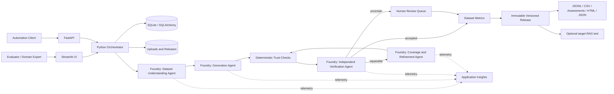

# RAGTrust Architecture and Operations

## Product purpose

RAGTrust creates a traceable synthetic evaluation dataset from trusted golden examples and source evidence. It separates generation from independent verification, routes uncertain cases to review, records every metric and repair attempt, and publishes immutable evaluation releases. Testing a deployed RAG endpoint is an optional downstream activity; it is not required to create a dataset.

## Deployed architecture

## Agent responsibilities

### 1. Dataset Understanding and Planning

The agent receives a bounded sample of golden questions, trusted answers, evidence snippets, domain, and generation target. It profiles topics, calculates a balanced plan, and discloses gaps or conflicts. It may organize supplied information but may not introduce domain facts.

Foundry asset: `ragtrust-dataset-understanding`, version 1.

### 2. Generation

The generator receives the plan and evidence. It produces provisional cases with a question, candidate reference answer, expected behavior, difficulty, scenario, source versions, exact evidence locators, and required facts. Its output is never accepted based on self-assessment.

Foundry asset: `ragtrust-generation`, version 1.

### 3. Independent Verification

The verifier receives the candidate and original evidence but no generator confidence or rationale. It decomposes the answer into atomic claims, checks citations, evaluates support, detects contradictions, and returns structured metrics plus a decision recommendation.

Foundry asset: `ragtrust-independent-verification`, version 1.

### 4. Coverage and Refinement

Only repairable failures are sent here. The agent removes unsupported material or replaces it with explicitly supported facts. The application limits repair attempts and preserves parent/child attempt links. Exhausted or uncertain cases go to human review.

Foundry asset: `ragtrust-coverage-refinement`, version 1.

## Trust boundary and deterministic controls

Python, not the language model, computes exact duplicate rate, semantic-near-duplicate candidates, citation existence, distribution divergence, topic coverage, numerical aggregates, hashes, and release manifests. Known segment IDs are normalized to immutable locators before verification. Foundry errors fail the live run; they never silently produce fixture-labelled output.

## Data lifecycle

1. A user creates a project and imports golden examples.
2. Source files are hashed, stored in a project-specific directory, and extracted into evidence segments.
3. A generation configuration sets target volume, accepted target, topic/difficulty mix, repair limit, and budget.
4. The planner produces the coverage plan.
5. The generator proposes candidates.
6. Deterministic checks and independent verification evaluate each candidate.
7. Repairable cases receive bounded refinement; uncertain cases wait for human review.
8. Dataset-level metrics describe coverage, duplicates, distribution, and accepted-case faithfulness.
9. Release creates immutable JSONL, CSV, case assessments, HTML report, and JSON summary with hashes and provenance.
10. The released dataset can optionally test a RAG endpoint separately.

## Security and privacy

- Authentication uses `DefaultAzureCredential`; secrets are not placed in source code.
- `.env`, local databases, uploads, and release data are excluded from repository and container build contexts.
- GenAI content capture is disabled by default; tracing can record operational telemetry without prompt bodies.
- Upload support is intentionally limited. A scanned PDF is marked `needs_ocr`; raw visual or audio understanding is not claimed.
- The prototype uses SQLite and a local worker. Production scale should replace them with managed PostgreSQL/SQL, blob storage, and a queue worker.

## Deployment modes

- Local fixture mode: deterministic demonstration with no cloud inference.
- Local Foundry mode: local UI/API with four persisted Foundry prompt agents.
- Container mode: one image can run the UI or API by setting `RAGTRUST_SERVICE=ui|api`.
- Azure web deployment: UI is exposed publicly while agent inference remains in the existing Foundry project.

## Verification evidence

- 26 automated tests pass.
- Each of the four persisted agents passed a live response smoke test.
- A complete Foundry-mode run generated 2 candidates, accepted 2, reported 100% topic coverage, zero exact duplicates, zero semantic duplicate pairs, and average accepted-case faithfulness of 1.0.
- Live run ID: `c508ab1b-a8ac-4cb0-9681-7608717837d5`.
- Live dataset version ID: `ac1c38a3-97cc-49e7-bd76-d8fbee4e1d5a`.

## Honest production limitations

This is a working hackathon product, not a fully managed enterprise service. The public single-instance build has ephemeral/local state unless mounted storage is configured. SQLite and an in-process worker are not suitable for horizontal scaling. Human correctness remains unassessed until reviewers label a representative sample. Ragas is an optional future adapter and is not the source of the current scores.
