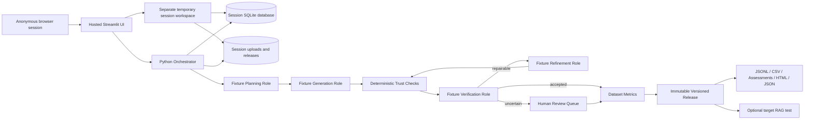

# RAGTrust Architecture and Operations

## Product purpose

RAGTrust creates a traceable synthetic evaluation dataset from trusted golden examples and source evidence. It separates generation from independent verification, routes uncertain cases to review, records every metric and repair attempt, and publishes immutable evaluation releases. Testing a deployed RAG endpoint is an optional downstream activity; it is not required to create a dataset.

## Public launch architecture: October 8, 2026

Launch verification is pending. This describes the public fixture configuration being prepared for the existing Azure host. The September private Foundry deployment and measured local live run remain historical evidence, described below.

The public website exposes Streamlit. The UI invokes orchestration directly and uses deterministic fixtures for all four roles. `RAGTRUST_PUBLIC_DEMO=true` disables Foundry calls at the client boundary even if cloud credentials or endpoints are present. FastAPI remains a local/private programmatic interface; public mode rejects its routes except `/health`, and no separate API is publicly hosted. The arrows show logical handoffs managed by Python.

Each browser session owns a `TemporaryDirectory`, SQLite database, service instance, uploads, and releases. Sessions have a two-hour maximum lifetime and reset on the next interaction after expiry. Disconnected sessions have a 120-second reconnect window. Downloaded exports can be retained by the user; the server workspace is temporary. This is session separation without accounts, tenant identity, durable storage, or restart recovery.

The public UI permits at most 20 candidates per run, one repair per case, and 5 MB per upload. The existing Azure F1 free plan remains the host. Use non-confidential demonstration data only.

## Agent responsibilities

These responsibilities are implemented by deterministic fixture rules in the public demo and by optional Foundry requests in local/private live mode. The asset names below identify the historical version-2 Foundry definitions; the public workspace does not invoke them.

### 1. Dataset Understanding and Planning

The agent receives a bounded sample of golden questions, trusted answers, evidence snippets, domain, and generation target. It profiles topics, calculates a balanced plan, and discloses gaps or conflicts. It may organize supplied information but may not introduce domain facts.

Foundry asset: `ragtrust-dataset-understanding`, version 2. Code preserves the configured language, difficulty mix, and question types, and enforces nonnegative topic quotas that sum to the target. Calibration and held-out examples are excluded from generation seeds.

### 2. Generation

The generator receives the plan and evidence. It produces provisional cases with a question, candidate reference answer, expected behavior, difficulty, scenario, source versions, exact evidence locators, and required facts. Its output is never accepted based on self-assessment.

Foundry asset: `ragtrust-generation`, version 2. Generated reference answers stay marked `automatically_derived` until reviewed. With golden examples alone, generation stays inside the evidence boundary derived from their trusted answers.

### 3. Independent Verification

The verifier receives the candidate and original evidence but no generator confidence or rationale. It decomposes the answer into atomic claims, checks citations, evaluates support, detects contradictions, and returns structured metrics plus a decision recommendation.

Foundry asset: `ragtrust-independent-verification`, version 2. Independent means a separate request and responsibility. The agents share a model deployment and can still share errors. Deterministic evidence failures override model acceptance.

### 4. Coverage and Refinement

Only repairable failures are sent here. The agent removes unsupported material or replaces it with explicitly supported facts. The application limits repair attempts and preserves parent/child attempt links. Exhausted or uncertain cases go to human review.

Foundry asset: `ragtrust-coverage-refinement`, version 2. This role currently repairs individual cases. Python reports dataset coverage gaps; autonomous repeated generation to fill every gap remains future work.

## Trust boundary and deterministic controls

Python computes exact duplicate rate, lexical-near-duplicate candidates, citation existence, distribution distance, topic coverage, numerical aggregates, hashes, and release manifests. The near-duplicate heuristic uses character-trigram cosine similarity with a threshold of 0.82; it is not a calibrated semantic embedding metric. Known segment IDs are normalized to exact locators before verification. Foundry errors fail the live run; they never silently produce fixture output.

Factual F1 remains not assessed without an independently trusted answer to the exact generated question. Accepted-case faithfulness is an automated estimate with a stated population; human correctness requires a separate representative audit. Version 2 instructions treat source documents as untrusted data rather than instructions.

## Data lifecycle

1. A user creates a project and imports golden examples.
2. Source files are hashed, stored in a project-specific directory, and extracted into evidence segments.
3. A generation configuration sets target volume, accepted target, topic/difficulty mix, repair limit, and budget.
4. The planner produces the coverage plan.
5. The generator proposes candidates.
6. Deterministic checks and independent verification evaluate each candidate.
7. Repairable cases receive bounded refinement; uncertain cases wait for human review.
8. Dataset-level metrics describe coverage, duplicates, distribution, and accepted-case faithfulness.
9. Release creates immutable JSONL, CSV, case assessments, HTML report, and JSON summary with hashes and provenance.
10. The frozen release can optionally test a public HTTPS RAG endpoint or recorded responses separately. This adapter records latency, errors, reference-token recall, and phrase-based abstention matching. It does not measure faithfulness, semantic relevance, factual accuracy, or retrieval quality. Fixture responses require explicit demo selection and are labelled.

## Security and privacy

- Anonymous public UI sessions use separate temporary storage and have a bounded lifetime. Do not upload confidential data. This is not account-based authorization or a secure document vault.
- Public mode disables live Foundry inference at the client boundary and blocks all FastAPI routes except `/health`. Private deployments can use `DefaultAzureCredential` and the optional demo-password/API-header gate; that shared password is not tenant identity.
- Target endpoints must use public HTTPS on port 443 without embedded credentials. The adapter validates resolved addresses, pins a public IP while retaining the original Host header and TLS server name, disables proxies and redirects, and limits responses to 1 MiB. Authenticated or private endpoints should use recorded responses instead.
- `.env`, local databases, uploads, and release data are excluded from repository and container build contexts.
- GenAI content capture is disabled by default; tracing can record operational telemetry without prompt bodies.
- Upload support is intentionally limited. A scanned PDF is marked `needs_ocr`; raw visual or audio understanding is not claimed.
- The prototype uses SQLite and a local worker. Production scale should replace them with managed PostgreSQL/SQL, blob storage, and a queue worker.

## Deployment modes

- Local fixture mode: deterministic demonstration with no cloud inference.
- Local Foundry mode: local UI/API with four persisted Foundry prompt agents.
- Container mode: one image can run the UI or API by setting `RAGTRUST_SERVICE=ui|api`.
- Public Azure mode: anonymous fixture-only Streamlit UI on the existing App Service F1 plan in Canada Central, with temporary session workspaces and no public lifecycle API.
- Historical September private Azure mode: the same host used a private demo-password gate, managed identity for the existing Foundry account in Sweden, and persistent working data under `/home/data`.

## Public launch verification

The suite includes public-session isolation and endpoint transport checks as part of the launch work. New test results, repository publication, and hosted public access verification are pending. See [the deployment manifest](DEPLOYMENT_MANIFEST.md) for the launch receipt when finalized.

## Historical verification: September 26 submission snapshot

- 35 automated tests passed before packaging.
- Earlier individual live smoke tests exercised all four version 1 roles, including a repair. The current definitions are version 2.
- A complete local-to-Foundry version 2 run generated 2 candidates, accepted 2, met both planned topic quotas, and reported zero exact duplicates, zero lexical near-duplicate pairs, and accepted-case faithfulness of 1.0. It exercised planner, generator, and verifier; no repair was needed.
- Live run ID: `f1a2ff2f-cde8-45d0-8e26-186af813b0bc`.
- Live dataset version ID: `d4957234-bbda-4a2a-81b9-f4640dccf444`.

This is a two-case workflow demonstration, not a population accuracy result. Local-to-Foundry execution does not by itself prove cloud-hosted end-to-end inference. Refer to the final deployment receipt for cloud verification. Application Insights initialization alone does not confirm that every trace was received.

## Honest production limitations

The public demo keeps SQLite and release files in temporary per-session workspaces. SQLite and an in-process worker are not suitable for horizontal scaling; a process recycle can interrupt a run, and restart-resumable jobs are not implemented. Sessions expire, so download exports you want to retain. The F1 host can cold-start or exhaust its free allowance. Managed database/blob adapters, a distributed queue, per-user identity, raw-media processing, calibrated semantic metrics, and continuous traffic evaluation remain future work. Human correctness remains unassessed until reviewers label a representative sample. Ragas is an optional future adapter and is not the source of the current scores. The September container package was not run locally because the Docker daemon was unavailable.
